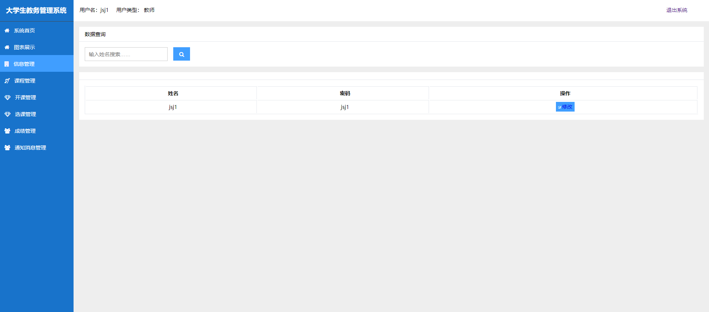

需要代码，联系微信 python_kk

需要代码，联系微信 python_kk

需要代码，联系微信 python_kk


一、主要技术：python、django、mysql、echarts、bootstrap、jquery、css、cookie、session等基本技术实现

**系统亮点1：python框架做毕设，做的人少！django开发便捷，容易毕业！！！！！！**

**系统亮点2：加入django结合echarts，可视化展示教务系统，管理员，老师，学生之间的关系！！！！！！**

**系统亮点3：多角色不同页面，管理员拥有管理员页面，老师有老师页面，学生有学生页面**

**系统亮点4：界面ui非常美观**


 二、主要功能:

管理员功能：

```
系统首页
图表展示
信息管理
学院管理
教师管理
学生管理
课程管理
开课管理
选课管理
成绩管理
通知消息管理
```


老师功能：

```
系统首页
图表展示
信息管理
课程管理
开课管理
选课管理
成绩管理
通知消息管理
```


学生功能：

```
系统首页
图表展示
信息管理
开课管理
选课管理
成绩管理
通知消息管理
```


通用功能：登录、退出、修改姓名、密码


管理员详细功能

1、登录，这里有登录判断，如果用户名 密码 身份不对会有报错


2、首页，首页这里用了bootstrap样式


3、管理员图表，这里主要是加入了echarts，可以让网站样式丰富，柱状图，饼图，折线图


4、管理员信息，这里可以修改个人密码


5、学院管理


6、教师管理，教师和学院有关联


7、学生管理，学生和学院有关联


8、课程管理，和学院有关联


9、开课管理，这里和老师，学院都有关联


10、选课管理，管理和老师可以对申请选课的学生进行审核，审核通过则代表课程通过


11、成绩管理，管理和老师可以对学生成绩评价


12、通知管理


13、老师首页


14、老师


15、老师密码修改




16、老师课程管理


17、老师开课管理


18、老师选课管理


19、老师成绩管理


20、老师通知管理


21、学生选课


22、学生成绩管理


